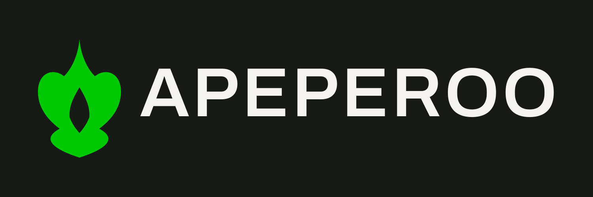

<p align="center">
  
</p>

<p align="center">
  
</p>

<h1 align="center">APEPEROO</h1>

<p align="center"><strong>Ape energy. ETH reserve.</strong></p>

<p align="center">
  An ETH treasury on Robinhood Chain.<br />
  Token <code>APRO</code> · launch rail <strong>Pons</strong> · utility <strong>Flame</strong>.
</p>

<p align="center">
  <a href="https://x.com/Apeperoo"></a>
  
  
  
</p>

---

Apeperoo is not another pool that dies after the first candle.

APRO launches on **Robinhood Chain** through **Pons** — fixed supply, locked WETH liquidity, one wallet-signed deploy. A **3%** trading fee lands in a public ETH treasury. **Flame** burns APRO in a last-burner round. The last wallet standing takes the **entire ETH pot**. Fewer tokens sit in front of the same ETH, so ETH per remaining token is the score.

This repo is the site, the Flame contract, and the public books.

<p align="center">
  
</p>

## The loop

```
  Pons launch ──► locked WETH pool
                       │
                       ▼
              3% fee ──► public treasury
                       │
                       ▼  (ETH sent by hand)
                    Flame pot
                       │
                       ▼
              burn APRO ──► last burner takes 100% ETH
```

Nothing is printed to pay the prize. If it is not onchain, it is not the score.

## Flame

Last burner wins. Clock is ten minutes. Quote starts at **100,000 APRO** and climbs **+5%** every accepted burn. A sixty-second response floor keeps the round from sniping itself dead. Seed the contract with **0.01 ETH** so round one already has a pot. Top up later by sending ETH to Flame, or calling `fund()`.

| Rule | Value |
| --- | --- |
| Round | 10 minutes |
| Response floor | 60 seconds |
| Quote step | +5% per burn |
| Opening quote | 100,000 APRO |
| Winner | last burn when the clock hits zero |
| Payout | 100% of the ETH pot |
| Seed | 0.01 ETH on deploy |

`contracts/Flame.sol` is unaudited. Do not treat it as production advice.

## Stack

| Layer | What |
| --- | --- |
| Site | Vite · React · Privy · viem |
| Chain | Robinhood Chain (ETH gas) |
| Launch | Pons · ticker APRO · WETH pair |
| Game | Flame · Solidity `^0.8.24` · Foundry tests |

Pages stay in preview until contract addresses are set. Dummy dashboard numbers are labeled preview on purpose.

## Run it

```bash
npm install
cp .env.example .env.local
npm run dev
```

Foundry tests:

```bash
forge test -vv
```

## Env

Fill `.env.local` after APRO is live. Do not commit secrets.

```
VITE_PRIVY_APP_ID=
VITE_APRO_ADDRESS=
VITE_FLAME_ADDRESS=
VITE_TREASURY_ADDRESS=
VITE_POOL_ADDRESS=
VITE_START_BLOCK=0
VITE_WETH_ADDRESS=0x0Bd7D308f8E1639FAb988df18A8011f41EAcAD73
```

Flame constructor: `(apro, startBurn)` with `startBurn = 100000000000000000000000`. Deploy value must be exactly `0.01` ETH.

## Not this

Apeperoo is **not** a listing on the Robinhood brokerage app, **not** Robinhood stock, and **not** affiliated with Robinhood Markets. PONS is the launchpad’s token, not ours. This is not investment advice.

<p align="center">
  <br />
  <a href="https://x.com/Apeperoo">Follow @Apeperoo</a>
  ·
  <a href="https://github.com/apeperoo/apeperoo">github.com/apeperoo/apeperoo</a>
</p>
